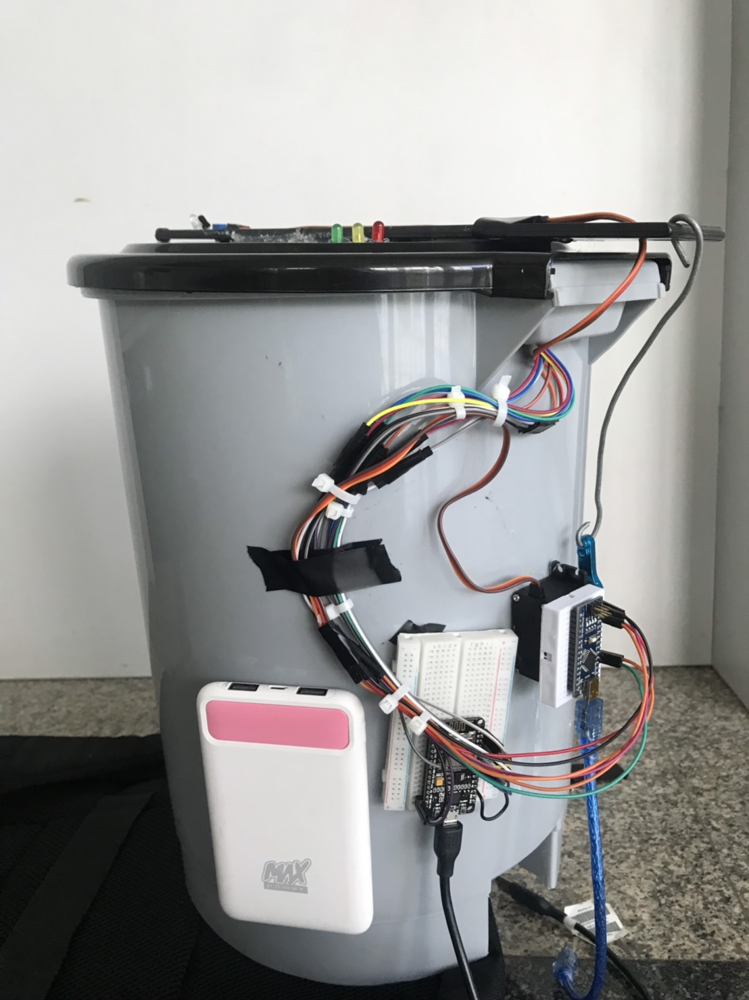
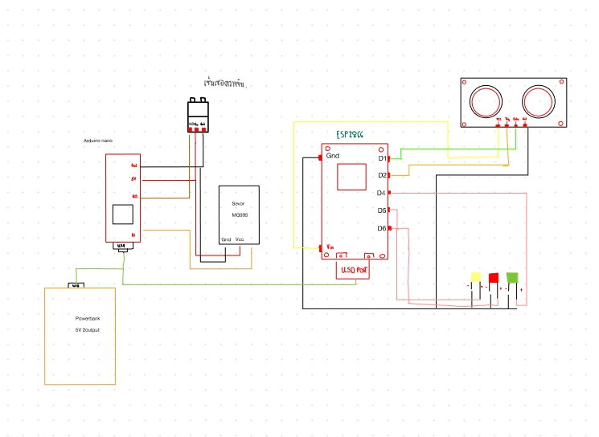

# SmartBin2077
# Introduction

การใช้ถังขยะ เดิมทีผู้ใช้จำเป็นต้องสัมผัสกับถังขยะซึ่งอาจทำให้สัมผัสกับสิ่งสกปรกไปด้วย แม้ว่าภายหลังจะมีการออกแบบถังขยะชนิดใช้เท้าเหยียบเพื่อเปิดฝามาใช้กันอย่างแพร่หลาย  แต่ก็ยังมีข้อจำกัดหรือความไม่สะดวกต่อการใช้งานในหลายกรณี อีกทั้งการใช้ถังขยะในสถานพยาบาลหรือห้องปฏิบัติการทางวิทยาศาสตร์ต่าง ๆ ที่มีทั้งขยะติดเชื้อและสารเคมีอันตรายมากมาย หากมีถังขยะที่สามารถทำให้ผู้ใช้ไม่ต้องสัมผัสกับตัวถังได้ 100% จะสามารถช่วยอำนวยความสะดวกและป้องกันการแพร่กระจายของเชื้อโรคได้ดียิ่งขึ้น จากที่กล่าวมานี้เพื่อความสะดวกสบาย ความปลอดภัย และความทันสมัยที่มากขึ้น ผู้จัดทำจึงเล็งเห็นถึงการนำเทคโนโลยีของไมโครคอนโทรลเลอร์มาใช้เพื่อพัฒนาถังขยะให้เป็นถังขยะอัตโนมัติเพื่อให้สามารถใช้งานโดยลดข้อจำกัดต่าง ๆ รวมทั้งอำนวยความสะดวกได้มากขึ้น 
โดยถังขยะอัตโนมัติมีหลักการทำงานผ่านเซนเซอร์วัตถุ ร่วมกับการทำงานของบอร์ดไมโครคอนโทรลเลอร์แบบนาโน และใช้ภาษาซีในการเขียนคำสั่งการทำงานต่าง ๆ 
คณะผู้จัดทำหวังว่าถังขยะอัตโนมัตินี้จะสามารถเพิ่มประสิทธิภาพในการนำไปใช้งาน อำนวยความสะดวกและเพิ่มสุขอนามัยที่ดี และเอื้อประโยชน์ต่อการใช้งานของกลุ่มผู้ใช้ที่ทำงานในห้องปฏิบัติการได้ดียิ่งขึ้น
# Diagram

# Code(ตัวเปิดถัง)
#include <Servo.h>
Servo myservo;
void setup() {

  // initialize serial communication at 9600 bits per second:
  Serial.begin(9600);
  myservo.attach(A1);
  pinMode(A0, INPUT);
}

// the loop routine runs over and over again forever:

void loop() {

  int sensorValue = analogRead(A0);
  if(sensorValue > 900){
    myservo.write(0);
    delay(1000);
    }
  else{
    myservo.write(180);
    delay(5000);
    }
  Serial.println(sensorValue);
}
# Code(ตัววัดระดับขยะ)
#define TRIGGER_PIN  5
#define ECHO_PIN     4
void Line_Notify(String message) ;
#include <ESP8266WiFi.h>
#include <WiFiClientSecureAxTLS.h>
// Config connect WiFi
#define WIFI_SSID "Nun"
#define WIFI_PASSWORD "12345678"
// Line config
#define LINE_TOKEN "gN4SVAxdxyQ2Xy7vASDEhSj2uN3FrsvwBvxO1pEfNex"
String message = "ถังขยะเต็มเเล้วครับท่านกรุณาเอาขยะไปทิ้งด้วยครับ";
void setup() {
  Serial.begin (9600);
  pinMode(TRIGGER_PIN, OUTPUT);
  pinMode(ECHO_PIN, INPUT);
  pinMode(BUILTIN_LED, OUTPUT);
  pinMode(D4, OUTPUT);
  pinMode(D5, OUTPUT);
  pinMode(D6, OUTPUT);
  pinMode(LED_BUILTIN, OUTPUT);
  WiFi.mode(WIFI_STA);
  // connect to wifi.
  WiFi.begin(WIFI_SSID, WIFI_PASSWORD);
  Serial.print("connecting");

  while (WiFi.status() != WL_CONNECTED) {
    Serial.print(".");
    delay(500);
  }
  Serial.println();
  Serial.print("connected: ");
  Serial.println(WiFi.localIP());
}

void loop() {
  // ตัวเซนเซอร์//
  digitalWrite(LED_BUILTIN, LOW); 
  long duration, distance;
  digitalWrite(TRIGGER_PIN, LOW);
  delayMicroseconds(2);
  digitalWrite(TRIGGER_PIN, HIGH);
  delayMicroseconds(10);
  digitalWrite(TRIGGER_PIN, LOW);
  duration = pulseIn(ECHO_PIN, HIGH);
  distance = (duration/2) / 29.1;
  
  {if(distance <= 28 && distance >= 18)
    digitalWrite(D4, HIGH);
    else
   digitalWrite(D4, LOW);}
  {if(distance <= 17 && distance >= 6)
    digitalWrite(D5, HIGH);
   else
   digitalWrite(D5, LOW);}
  {if(distance <= 5){
    digitalWrite(D6, HIGH);
    Serial.println("Enter !");
    Line_Notify(message);}
   else
    digitalWrite(D6, LOW);}
  Serial.print(distance);
  Serial.println(" cm");
  delay(100);
}
void Line_Notify(String message) {
  axTLS::WiFiClientSecure client;

  if (!client.connect("notify-api.line.me", 443)) {
    Serial.println("connection failed");
    return;   
  }

  String req = "";
  req += "POST /api/notify HTTP/1.1\r\n";
  req += "Host: notify-api.line.me\r\n";
  req += "Authorization: Bearer " + String(LINE_TOKEN) + "\r\n";
  req += "Cache-Control: no-cache\r\n";
  req += "User-Agent: ESP8266\r\n";
  req += "Connection: close\r\n";
  req += "Content-Type: application/x-www-form-urlencoded\r\n";
  req += "Content-Length: " + String(String("message=" + message).length()) + "\r\n";
  req += "\r\n";
  req += "message=" + message;
  // Serial.println(req);
  client.print(req);
    
  delay(20);

  // Serial.println("-------------");
  while(client.connected()) {
    String line = client.readStringUntil('\n');
    if (line == "\r") {
      break;
    }
    //Serial.println(line);
  }
  // Serial.println("-------------");
}
#Team Members
|  |ชื่อ|นามสกุล|GitHub Username|รหัสนักศึกษา|
|:-:|--|------|---------------|---------|
||Nuntavat|Suthankornkul|[@Nun0289](https://github.com/Nun0289)|61070103|
||thanawath|Petavibonsatean|[@IVYSS](https://github.com/IVYSS)|61070075|
||Kanyawee|tanpipath|[@Kanyawee-Tanpipath](https://github.com/Kanyawee-Tanpipath)|6100010|

#Assistant Teacher
|ผศ. ดร. กิติ์สุชาต พสุภา|ผศ. ดร. ปานวิทย์ ธุวะนุติ|

รายงาน และ ซอร์สโค้ดนี้ เป็นส่วนหนึ่งของวิชา การสร้างโปรแกรมคอมพิวเตอร์ Computer Programming 
หลักสูตรวิทยาศาสตร์บัณฑิต สาขาวิชาเทคโนโลยีสารสนเทศ 
ภาคเรียนที่ 2 ปีการศึกษา 2562 
คณะเทคโนโลยีสารสนเทศ 
สถาบันเทคโนโลยีพระจอมเกล้าเจ้าคุณทหารลาดกระบัง 
